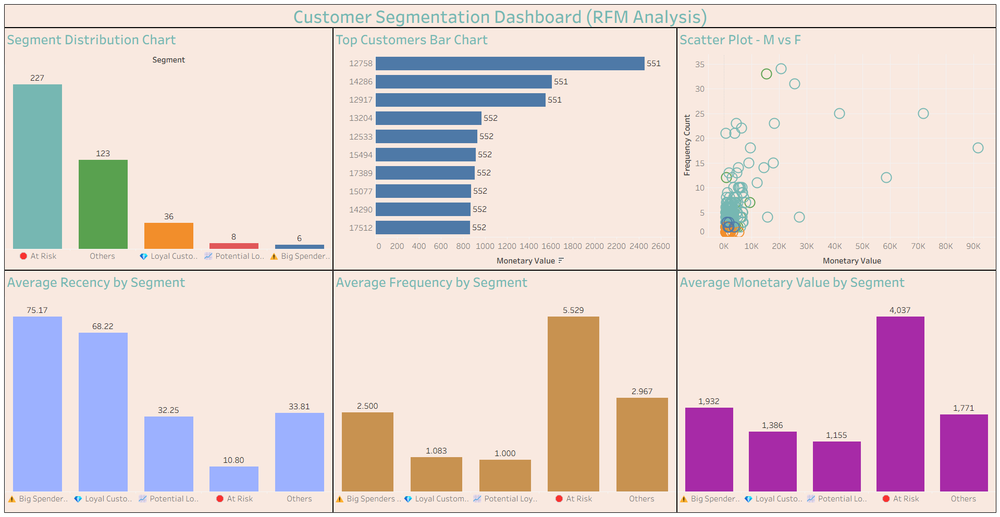

# Customer Segmentation using RFM Analysis

## 📌 Problem Statement
Businesses need to identify valuable customers to improve retention and marketing strategies. This project uses RFM (Recency, Frequency, Monetary) analysis to segment customers based on purchasing behavior.

---

## 🛠 Tools & Technologies
- SQL (MySQL)
- Tableau

---

## 📊 Analysis Performed
- Data Cleaning and Transformation
- RFM Metric Calculation (Recency, Frequency, Monetary)
- Customer Segmentation based on RFM scores

---

## 📈 Key Insights
- High-value customers contribute significantly to revenue
- Certain customer segments are at risk due to low engagement
- RFM segmentation enables targeted marketing strategies

---

## 📊 Dashboard Preview

---

## 📁 Dataset

### Raw Data
The original dataset is large and not uploaded to GitHub.

🔗 [Download Raw Dataset](YOUR_GOOGLE_DRIVE_LINK_HERE)

### Processed Data
The processed dataset used for analysis is available in:
data/segmented/rfm_segmented.csv

---

## 📂 Project Structure

data/
├── raw/ → original dataset (available via Google Drive link)  
└── segmented/ → processed dataset after RFM analysis  

scripts/ → SQL queries for data cleaning and segmentation  

reports/ → Tableau dashboard file  

dashboards/ → dashboard screenshots  

---

## 🚀 How to Use
1. Download the raw dataset from the link above  
2. Run SQL scripts from `scripts/` to process data  
3. Open Tableau file from `reports/` to view dashboard  

---

## 👤 Author
**Sanjay Reddy Challa**  
- LinkedIn: https://www.linkedin.com/in/sanjay-reddy-challa-312987245/
